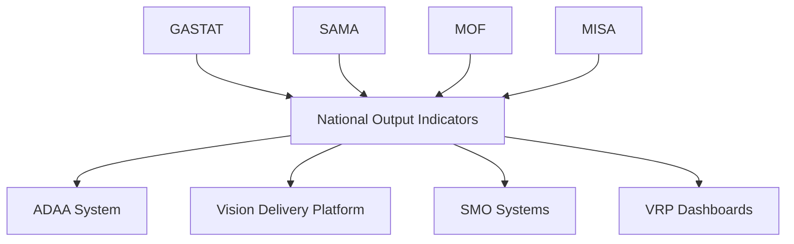
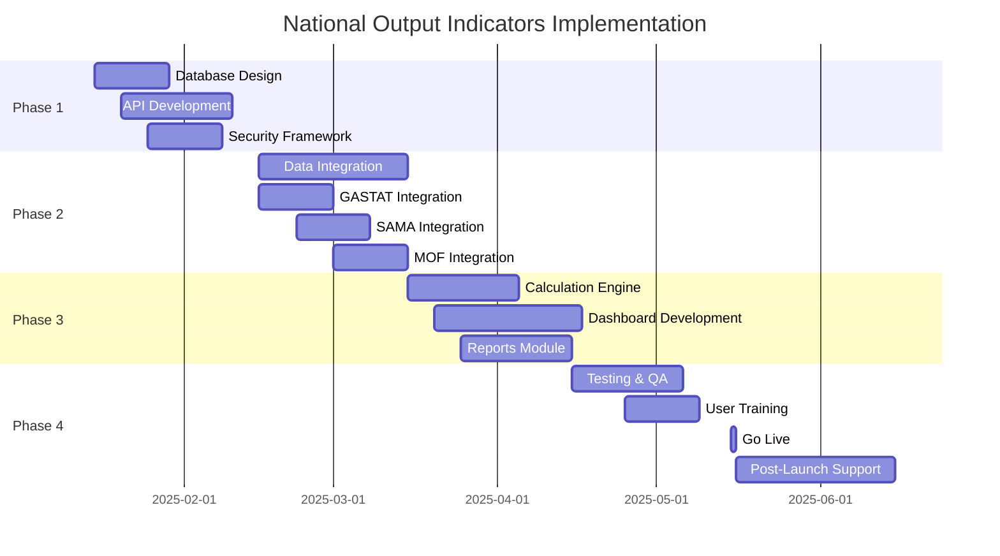

# National Output Indicators Module
## Performance Management System - Vision 2030

---

## Table of Contents
1. [Executive Overview](#executive-overview)
2. [System Architecture](#system-architecture)
3. [Indicator Categories](#indicator-categories)
4. [Data Model](#data-model)
5. [Integration Points](#integration-points)
6. [Implementation Guide](#implementation-guide)
7. [Business Rules](#business-rules)
8. [User Interface Components](#user-interface-components)
9. [API Specifications](#api-specifications)
10. [Appendices](#appendices)

---

## Executive Overview

### Purpose
National Output Indicators represent the highest-level outcome KPIs for the country. They include macroeconomic and sectoral indicators such as non-oil GDP, productivity, employment, FDI, IPI, and other national outcomes. All performance frameworks ultimately contribute to these indicators.

### Key Characteristics
- **Hierarchy Level**: Level 0 (Highest - National Outcomes)
- **Ownership**: National Center for Performance Management (ADAA)
- **Update Frequency**: Quarterly/Annual
- **Data Sources**: GASTAT, SAMA, Ministry of Finance, Sectoral Authorities
- **Parent Frameworks**: Can have none, one (Vision 2030 or National Strategy), or multiple parents
- **Lifecycle**: Support migration paths as governance evolves

### System Context
```
National Output Indicators (Level 0)
    ├── Vision 2030 Indicators (Level 1 - Parallel Framework)
    │   ├── Pillars
    │   ├── Axes/Themes
    │   ├── Strategic Objectives
    │   └── Programs/Initiatives
    │
    ├── National Strategy Indicators (Level 1 - Parallel Framework)
    │   ├── Pillars
    │   ├── Axes/Themes
    │   ├── Strategic Objectives
    │   └── Programs/Initiatives
    │
    └── Independent Indicators (No Framework Assignment)
```

---

## System Architecture

### Module Components

```javascript
NationalOutputModule = {
  core: {
    indicatorManagement: "CRUD operations for national indicators",
    calculationEngine: "Complex formula processing",
    aggregationService: "Roll-up from lower levels",
    validationService: "Data quality checks"
  },
  integration: {
    dataIngestion: "External data source integration",
    apiGateway: "RESTful API services",
    reportingEngine: "Automated report generation",
    notificationService: "Alert management"
  },
  analytics: {
    trendAnalysis: "Historical trend processing",
    forecastingEngine: "Predictive analytics",
    benchmarkingService: "International comparisons",
    contributionAnalysis: "Program impact assessment"
  }
}
```

---

## Indicator Categories

### 1. Economic Production Indicators

#### 1.1 Gross Domestic Product (GDP)
```yaml
indicator:
  code: NOI.GDP.001
  nameAr: الناتج المحلي الإجمالي
  nameEn: Gross Domestic Product
  unit: SAR Billion
  frequency: Quarterly
  source: GASTAT
  formula: C + I + G + (X - M)
  components:
    - consumption
    - investment
    - government_spending
    - net_exports
  baseline: 2,418.5  # 2016 value
  target2030: 4,200.0
  polarity: increasing
```

#### 1.2 Non-Oil GDP
```yaml
indicator:
  code: NOI.GDP.002
  nameAr: الناتج المحلي غير النفطي
  nameEn: Non-Oil GDP
  unit: SAR Billion
  frequency: Quarterly
  source: GASTAT
  weight: 0.35  # Critical Vision 2030 indicator
  baseline: 1,439.0
  target2030: 2,900.0
  polarity: increasing
  programs_contributing:
    - National Transformation Program
    - Financial Sector Development Program
    - National Industrial Development Program
```

### 2. Sectoral Output Indicators

#### 2.1 Industrial Production Index
```yaml
indicator:
  code: NOI.IND.001
  nameAr: مؤشر الإنتاج الصناعي
  nameEn: Industrial Production Index
  unit: Index (2010=100)
  frequency: Monthly
  source: GASTAT
  components:
    - manufacturing: 0.60
    - mining: 0.25
    - utilities: 0.15
```

#### 2.2 Services Sector Output
```yaml
indicator:
  code: NOI.SRV.001
  nameAr: ناتج قطاع الخدمات
  nameEn: Services Sector Output
  unit: SAR Billion
  subSectors:
    - tourism_hospitality
    - financial_services
    - telecommunications
    - retail_wholesale
    - transportation_logistics
```

### 3. Productivity Indicators

#### 3.1 Labor Productivity
```yaml
indicator:
  code: NOI.PRD.001
  nameAr: إنتاجية العمل
  nameEn: Labor Productivity
  unit: SAR/Worker/Hour
  formula: GDP / (Total_Workers × Average_Hours)
  frequency: Annual
  benchmark:
    regional: UAE, Qatar, Kuwait
    international: South Korea, Singapore
```

#### 3.2 Total Factor Productivity
```yaml
indicator:
  code: NOI.PRD.002
  nameAr: الإنتاجية الكلية للعوامل
  nameEn: Total Factor Productivity
  unit: Index
  calculation_method: Solow Residual
  components:
    - capital_input
    - labor_input
    - technology_factor
```

### 4. Value Added Indicators

#### 4.1 Manufacturing Value Added
```yaml
indicator:
  code: NOI.VAD.001
  nameAr: القيمة المضافة للتصنيع
  nameEn: Manufacturing Value Added
  unit: % of GDP
  baseline: 12.4%
  target2030: 17.0%
  key_industries:
    - petrochemicals
    - automotive
    - pharmaceuticals
    - food_processing
```

#### 4.2 Digital Economy Value Added
```yaml
indicator:
  code: NOI.VAD.002
  nameAr: القيمة المضافة للاقتصاد الرقمي
  nameEn: Digital Economy Value Added
  unit: % of GDP
  components:
    - ecommerce
    - fintech
    - digital_services
    - data_economy
```

### 5. Trade & Investment Output

#### 5.1 Export Value
```yaml
indicator:
  code: NOI.TRD.001
  nameAr: قيمة الصادرات
  nameEn: Export Value
  unit: SAR Billion
  categories:
    - oil_exports
    - non_oil_exports
    - services_exports
```

#### 5.2 Foreign Direct Investment
```yaml
indicator:
  code: NOI.INV.001
  nameAr: الاستثمار الأجنبي المباشر
  nameEn: Foreign Direct Investment
  unit: SAR Billion
  frequency: Quarterly
  sectors_tracked:
    - manufacturing
    - technology
    - tourism
    - renewable_energy
```

---

## Framework Relationships

### Parallel Framework Model

National Output Indicators support multiple parallel frameworks, not a single hierarchy:

```javascript
const frameworkRelationships = {
  vision2030: {
    type: "parallel_framework",
    level: 1,
    timeframe: "2016-2030",
    structure: {
      pillars: ["Vibrant Society", "Thriving Economy", "Ambitious Nation"],
      axes: ["Government Effectiveness", "Economic Diversification"],
      objectives: 96,
      programs: 15, // VRPs
      initiatives: 500+
    }
  },
  
  nationalStrategies: {
    type: "parallel_framework",
    level: 1,
    examples: [
      {
        name: "National Tourism Strategy",
        timeframe: "2020-2040",
        extends_beyond_vision: true
      },
      {
        name: "National Industrial Strategy",
        timeframe: "2020-2035"
      },
      {
        name: "Digital Government Strategy",
        timeframe: "2020-2030"
      }
    ],
    structure: "identical_to_vision" // Same cascade model
  },
  
  independentIndicators: {
    type: "standalone",
    level: 0,
    description: "National indicators without framework assignment",
    examples: ["Inflation Rate", "Exchange Rate Stability"]
  }
};
```

### Indicator Parent Mapping

```sql
-- Flexible parent mapping table
CREATE TABLE noi_framework_mappings (
    mapping_id INT PRIMARY KEY AUTO_INCREMENT,
    indicator_id VARCHAR(20) NOT NULL,
    framework_type VARCHAR(50), -- 'vision2030', 'national_strategy', null
    framework_id VARCHAR(50),   -- Specific framework identifier
    parent_level VARCHAR(50),   -- 'pillar', 'axis', 'objective', 'program'
    parent_id VARCHAR(50),      -- Specific parent element ID
    mapping_weight DECIMAL(5,4), -- Contribution weight
    start_date DATE,
    end_date DATE,
    is_primary BOOLEAN DEFAULT FALSE,
    status VARCHAR(20) DEFAULT 'active',
    FOREIGN KEY (indicator_id) REFERENCES national_output_indicators(indicator_id)
);

-- Example: Non-oil GDP mapped to multiple frameworks
INSERT INTO noi_framework_mappings VALUES
    (1, 'NOI.GDP.002', 'vision2030', 'V2030', 'pillar', 'thriving_economy', 0.50, '2016-01-01', '2030-12-31', true, 'active'),
    (2, 'NOI.GDP.002', 'national_strategy', 'NIS', 'objective', 'industrial_growth', 0.30, '2020-01-01', '2035-12-31', false, 'active'),
    (3, 'NOI.GDP.002', 'national_strategy', 'NTS', 'objective', 'tourism_gdp', 0.20, '2020-01-01', '2040-12-31', false, 'active');
```

---

## Indicator Lifecycle Management

### Post-2030 Transition Model

```javascript
const indicatorLifecycle = {
  states: {
    DRAFT: "Under development",
    ACTIVE: "Currently measured and reported",
    MIGRATING: "Transitioning to new framework",
    MIGRATED: "Successfully moved to new parent",
    SUNSET: "Phasing out measurement",
    ARCHIVED: "Historical reference only",
    MERGED: "Combined with another indicator",
    REPLACED: "Superseded by new indicator"
  },
  
  migrationWorkflow: {
    steps: [
      "identify_target_framework",
      "map_new_relationships",
      "parallel_reporting_period", // Report in both frameworks
      "validate_continuity",
      "complete_migration",
      "archive_old_mapping"
    ],
    
    preserveOnMigration: [
      "indicator_id",       // Stable identifier
      "historical_values",  // Time series data
      "calculation_formula",
      "data_sources",
      "version_history"
    ]
  }
};
```

### Migration Tracking Table

```sql
CREATE TABLE noi_migrations (
    migration_id INT PRIMARY KEY AUTO_INCREMENT,
    indicator_id VARCHAR(20) NOT NULL,
    migration_type VARCHAR(50), -- 'framework_change', 'merge', 'split', 'replace'
    source_framework VARCHAR(50),
    target_framework VARCHAR(50),
    migration_reason TEXT,
    initiated_date DATE,
    parallel_start DATE,  -- Start dual reporting
    parallel_end DATE,    -- End dual reporting
    completed_date DATE,
    migration_status VARCHAR(20),
    continuity_factor DECIMAL(5,4), -- Data continuity adjustment
    approval_reference VARCHAR(100),
    notes TEXT,
    FOREIGN KEY (indicator_id) REFERENCES national_output_indicators(indicator_id)
);
```

---

## Independent Indicators Support

### Handling Framework-Orphan Indicators

```javascript
class IndependentIndicatorManager {
  // Support indicators without forced parent assignment
  registerIndependent(indicator) {
    return {
      ...indicator,
      framework_type: 'independent',
      parent_framework: null,
      rationale: indicator.independence_reason,
      reporting_entity: indicator.owner_entity,
      review_cycle: 'annual' // Check if framework assignment needed
    };
  }
  
  // Periodic review for potential framework assignment
  reviewForFrameworkAlignment(indicatorId) {
    const criteria = {
      has_strategic_relevance: this.checkStrategicAlignment(indicatorId),
      requested_by_framework: this.checkFrameworkRequests(indicatorId),
      measurement_maturity: this.assessDataQuality(indicatorId)
    };
    
    if (Object.values(criteria).some(v => v === true)) {
      return this.proposeFrameworkAssignment(indicatorId);
    }
    return { maintain: 'independent', next_review: '+1 year' };
  }
}
```

---

## Data Model

### Objective Distribution Model

The system follows a pyramid structure for objective distribution:

```yaml
objectiveHierarchy:
  level1_national:
    count: ~3
    description: "Small set of national-level objectives"
    examples: ["Economic Diversification", "Social Development", "Government Effectiveness"]
  
  level2_sectoral:
    count: ~27
    description: "Mid-level sectoral or VRP objectives"
    examples: ["Tourism Growth", "Industrial Development", "Digital Transformation"]
  
  level3_program:
    count: ~96
    description: "Detailed program/ministry objectives"
    mapping: "Direct to Vision 2030 strategic objectives"
```

### Core Tables Structure

```sql
-- Main National Output Indicators Table (Enhanced)
CREATE TABLE national_output_indicators (
    indicator_id VARCHAR(20) PRIMARY KEY,
    indicator_code VARCHAR(20) UNIQUE NOT NULL,
    name_ar NVARCHAR(255) NOT NULL,
    name_en VARCHAR(255) NOT NULL,
    category VARCHAR(50) NOT NULL,
    subcategory VARCHAR(50),
    unit_ar NVARCHAR(50),
    unit_en VARCHAR(50),
    frequency VARCHAR(20),
    polarity VARCHAR(20),
    weight DECIMAL(5,4),
    formula TEXT,
    data_source VARCHAR(100),
    owner_entity VARCHAR(100),
    baseline_value DECIMAL(20,4),
    baseline_year INT,
    target_2030 DECIMAL(20,4),
    target_2035 DECIMAL(20,4), -- For national strategies
    target_2040 DECIMAL(20,4), -- For long-term strategies
    lifecycle_status VARCHAR(20) DEFAULT 'active',
    is_independent BOOLEAN DEFAULT FALSE,
    is_active BOOLEAN DEFAULT TRUE,
    created_date TIMESTAMP DEFAULT CURRENT_TIMESTAMP,
    modified_date TIMESTAMP DEFAULT CURRENT_TIMESTAMP ON UPDATE CURRENT_TIMESTAMP
);

-- Actual Values Table
CREATE TABLE noi_actual_values (
    value_id BIGINT PRIMARY KEY AUTO_INCREMENT,
    indicator_id VARCHAR(20) NOT NULL,
    period_year INT NOT NULL,
    period_quarter INT,
    period_month INT,
    actual_value DECIMAL(20,4) NOT NULL,
    preliminary_flag BOOLEAN DEFAULT FALSE,
    revised_value DECIMAL(20,4),
    revision_date DATE,
    data_quality_score INT CHECK (data_quality_score BETWEEN 1 AND 100),
    verification_status VARCHAR(20),
    verified_by VARCHAR(100),
    verification_date TIMESTAMP,
    source_document VARCHAR(255),
    notes TEXT,
    created_date TIMESTAMP DEFAULT CURRENT_TIMESTAMP,
    FOREIGN KEY (indicator_id) REFERENCES national_output_indicators(indicator_id)
);

-- Program Contribution Mapping
CREATE TABLE noi_program_contributions (
    contribution_id INT PRIMARY KEY AUTO_INCREMENT,
    indicator_id VARCHAR(20) NOT NULL,
    program_code VARCHAR(20) NOT NULL,
    contribution_weight DECIMAL(5,4),
    contribution_formula TEXT,
    is_direct BOOLEAN DEFAULT TRUE,
    start_date DATE,
    end_date DATE,
    FOREIGN KEY (indicator_id) REFERENCES national_output_indicators(indicator_id)
);

-- International Benchmarks
CREATE TABLE noi_benchmarks (
    benchmark_id INT PRIMARY KEY AUTO_INCREMENT,
    indicator_id VARCHAR(20) NOT NULL,
    country_ar NVARCHAR(100),
    country_en VARCHAR(100),
    benchmark_value DECIMAL(20,4),
    benchmark_year INT,
    source_ar NVARCHAR(255),
    source_en VARCHAR(255),
    benchmark_type VARCHAR(20), -- 'regional' or 'international'
    FOREIGN KEY (indicator_id) REFERENCES national_output_indicators(indicator_id)
);
```

---

## Integration Points

### 1. Data Sources

```javascript
const dataSourceIntegrations = {
  GASTAT: {
    endpoint: "https://api.stats.gov.sa/v2/indicators",
    frequency: "quarterly",
    authentication: "OAuth2",
    indicators: ["GDP", "IPI", "CPI", "Employment"]
  },
  SAMA: {
    endpoint: "https://api.sama.gov.sa/monetary/indicators",
    frequency: "monthly",
    indicators: ["Money_Supply", "Interest_Rates", "FX_Reserves"]
  },
  MOF: {
    endpoint: "internal/mof/budget/api",
    frequency: "quarterly",
    indicators: ["Government_Revenue", "Government_Expenditure"]
  },
  MISA: {
    endpoint: "https://misa.gov.sa/api/investment",
    frequency: "quarterly",
    indicators: ["FDI", "Domestic_Investment"]
  }
};
```

### 2. System Integrations



---

## Implementation Guide

### Phase 1: Core Infrastructure (Weeks 1-4)

```javascript
// 1. Database Setup
const setupDatabase = async () => {
  await createTables();
  await createIndexes();
  await setupPartitioning(); // For time-series data
  await createMaterializedViews(); // For performance
};

// 2. API Framework
const setupAPIs = () => {
  // RESTful endpoints
  app.get('/api/noi/indicators', getIndicators);
  app.get('/api/noi/indicators/:id', getIndicatorById);
  app.post('/api/noi/indicators/:id/values', addActualValue);
  app.get('/api/noi/indicators/:id/trends', getTrends);
  app.get('/api/noi/indicators/:id/forecast', getForecast);
};

// 3. Authentication & Authorization
const setupSecurity = () => {
  // Role-based access
  const roles = {
    'ADAA_ADMIN': ['all'],
    'VRO_ANALYST': ['read', 'analyze'],
    'SMO_MANAGER': ['read', 'report'],
    'PROGRAM_OWNER': ['read_own', 'contribute']
  };
};
```

### Phase 2: Data Ingestion (Weeks 5-8)

```javascript
// Automated Data Collection
class DataIngestionService {
  async collectGASTATData() {
    const indicators = await this.fetchFromGASTAT();
    await this.validateData(indicators);
    await this.storeData(indicators);
    await this.triggerCalculations();
  }
  
  async validateData(data) {
    // Business rule validations
    if (!this.checkCompleteness(data)) {
      throw new DataQualityException();
    }
    if (!this.checkConsistency(data)) {
      await this.flagForReview(data);
    }
  }
}
```

### Phase 3: Calculation Engine (Weeks 9-12)

```javascript
// Complex Calculations
class CalculationEngine {
  calculateNonOilGDP(data) {
    const totalGDP = data.gdp_total;
    const oilGDP = data.gdp_oil;
    return {
      value: totalGDP - oilGDP,
      growth_rate: this.calculateGrowthRate(currentValue, previousValue),
      contribution_to_total: ((totalGDP - oilGDP) / totalGDP) * 100,
      target_achievement: this.calculateTargetAchievement(currentValue, target)
    };
  }
  
  calculateProductivity(data) {
    const output = data.gdp;
    const labor_hours = data.total_workers * data.avg_hours;
    return output / labor_hours;
  }
  
  aggregateProgramContributions(indicatorId) {
    // Roll up from program level
    const contributions = this.getProgramContributions(indicatorId);
    return contributions.reduce((sum, contrib) => {
      return sum + (contrib.value * contrib.weight);
    }, 0);
  }
}
```

---

## Business Rules

### Critical Business Rules

```javascript
const businessRules = {
  // BR-NOI-001: Data Freshness
  dataFreshness: {
    rule: "Quarterly data must be updated within 45 days of quarter end",
    validation: (lastUpdate, quarterEnd) => {
      return daysDiff(lastUpdate, quarterEnd) <= 45;
    }
  },
  
  // BR-NOI-002: Variance Thresholds
  varianceThresholds: {
    acceptable: 0.05,  // 5%
    warning: 0.10,     // 10%
    critical: 0.15,    // 15%
    action: (variance) => {
      if (variance > 0.15) return 'ESCALATE';
      if (variance > 0.10) return 'ALERT';
      if (variance > 0.05) return 'MONITOR';
      return 'OK';
    }
  },
  
  // BR-NOI-003: Achievement Calculation
  achievementCalculation: {
    formula: "((Actual - Baseline) / (Target - Baseline)) * 100",
    polarityAdjustment: (value, polarity) => {
      return polarity === 'decreasing' ? (100 - value) : value;
    }
  },
  
  // BR-NOI-004: Data Quality Scoring
  dataQualityScoring: {
    factors: {
      timeliness: 0.30,
      completeness: 0.30,
      accuracy: 0.25,
      consistency: 0.15
    },
    minimumAcceptable: 70
  },
  
  // BR-NOI-005: Approval Workflow
  approvalWorkflow: {
    levels: {
      dataEntry: ['SMO_Analyst'],
      verification: ['ADAA_Reviewer'],
      approval: ['ADAA_Director'],
      publication: ['VRO_Executive']
    }
  },
  
  // BR-NOI-006: Framework Assignment Rules
  frameworkAssignment: {
    allowMultipleParents: true,
    requirePrimaryDesignation: true,
    independentIndicatorCriteria: {
      noStrategicAlignment: true,
      crossCuttingNature: true,
      externalRequirement: true // e.g., international reporting
    }
  },
  
  // BR-NOI-007: Migration Rules
  indicatorMigration: {
    requireApproval: true,
    parallelReportingMinDuration: 90, // days
    preserveTimeSeriesContinuity: true,
    allowedMigrationTypes: ['framework_change', 'merge', 'split', 'replace']
  },
  
  // BR-NOI-008: Lifecycle Management
  lifecycleTransitions: {
    allowedTransitions: {
      'draft': ['active'],
      'active': ['migrating', 'sunset'],
      'migrating': ['migrated', 'active'],
      'migrated': ['active', 'archived'],
      'sunset': ['archived'],
      'archived': [] // Terminal state
    }
  }
};
```

---

## Required System Capabilities

### Platform Requirements

The system must support the following capabilities for the flexible framework model:

```javascript
const systemCapabilities = {
  frameworkManagement: {
    multiFrameworkMapping: "Map indicators to multiple frameworks simultaneously",
    parallelHierarchies: "Support Vision 2030 and National Strategies as equals",
    independentIndicators: "Allow indicators without parent assignment",
    flexibleLineage: "Track complex parent-child relationships"
  },
  
  lifecycleManagement: {
    indicatorMigration: "Workflow for moving indicators between frameworks",
    versionControl: "Maintain full history during transitions",
    identityPreservation: "Stable IDs across framework changes",
    timeSeriesContinuity: "Preserve data continuity during migration"
  },
  
  dataIntegration: {
    crossFrameworkAggregation: "Roll up across different hierarchies",
    weightedContributions: "Support varying contribution weights",
    unifiedMetadata: "Consistent KPI definitions across frameworks",
    consolidatedReporting: "Single view across all frameworks"
  },
  
  governanceSupport: {
    approvalWorkflows: "Multi-level approval for changes",
    auditTrails: "Complete change history",
    lineageVisualization: "Display dependency graphs",
    impactAnalysis: "Assess migration impacts"
  }
};
```

### Implementation Components

```javascript
class NationalOutputSystem {
  constructor() {
    this.frameworks = new FrameworkManager();
    this.indicators = new IndicatorRepository();
    this.migrations = new MigrationEngine();
    this.lineage = new LineageTracker();
  }
  
  // Support multiple framework assignment
  assignToFrameworks(indicatorId, frameworkMappings) {
    frameworkMappings.forEach(mapping => {
      this.validateFrameworkExists(mapping.frameworkId);
      this.createMapping(indicatorId, mapping);
      this.updateLineage(indicatorId, mapping);
    });
  }
  
  // Handle post-2030 transitions
  async migrateIndicator(indicatorId, targetFramework) {
    const migration = await this.migrations.initiate({
      indicator: indicatorId,
      source: this.getCurrentFramework(indicatorId),
      target: targetFramework,
      preserveHistory: true,
      parallelPeriod: 90 // days
    });
    
    return this.migrations.execute(migration);
  }
  
  // Support independent indicators
  registerIndependent(indicator) {
    return this.indicators.create({
      ...indicator,
      isIndependent: true,
      frameworkMappings: []
    });
  }
  
  // Unified KPI tree across frameworks
  getConsolidatedTree() {
    return {
      nationalOutput: this.indicators.getLevel0(),
      vision2030: this.frameworks.getVisionTree(),
      nationalStrategies: this.frameworks.getStrategyTrees(),
      independent: this.indicators.getIndependent()
    };
  }
}
```

---

## User Interface Components

### 1. Dashboard Layout

```html
<!-- National Output Dashboard -->
<div class="noi-dashboard">
  <!-- Summary Cards -->
  <div class="summary-grid">
    <div class="metric-card">
      <h3>الناتج المحلي الإجمالي</h3>
      <div class="value">SAR 3,245.6B</div>
      <div class="change positive">+4.2%</div>
      <div class="progress-bar" data-achievement="75%"></div>
    </div>
    
    <div class="metric-card">
      <h3>الناتج غير النفطي</h3>
      <div class="value">SAR 2,156.3B</div>
      <div class="change positive">+6.8%</div>
      <div class="progress-bar" data-achievement="82%"></div>
    </div>
  </div>
  
  <!-- Trend Charts -->
  <div class="charts-section">
    <canvas id="gdpTrendChart"></canvas>
    <canvas id="sectoralContributionChart"></canvas>
  </div>
  
  <!-- Data Table -->
  <table class="noi-data-table">
    <thead>
      <tr>
        <th>المؤشر</th>
        <th>القيمة الحالية</th>
        <th>المستهدف 2030</th>
        <th>نسبة الإنجاز</th>
        <th>الاتجاه</th>
        <th>الحالة</th>
      </tr>
    </thead>
    <tbody id="noiTableBody">
      <!-- Dynamic content -->
    </tbody>
  </table>
</div>
```

### 2. Entry Form

```html
<!-- National Output Indicator Entry Form -->
<form id="noiEntryForm" class="indicator-form">
  <div class="form-section">
    <h4>بيانات المؤشر الأساسية</h4>
    
    <div class="form-group">
      <label>رمز المؤشر *</label>
      <input type="text" name="indicator_code" required 
             pattern="NOI\.[A-Z]{3}\.\d{3}" 
             placeholder="NOI.GDP.001">
    </div>
    
    <div class="form-group">
      <label>اسم المؤشر (عربي) *</label>
      <input type="text" name="name_ar" required 
             pattern="[\u0600-\u06FF\s]+" 
             maxlength="255">
    </div>
    
    <div class="form-group">
      <label>اسم المؤشر (English) *</label>
      <input type="text" name="name_en" required 
             pattern="[a-zA-Z0-9\s]+" 
             maxlength="255">
    </div>
    
    <div class="form-group">
      <label>الفئة *</label>
      <select name="category" required>
        <option value="">اختر الفئة</option>
        <option value="economic_production">الإنتاج الاقتصادي</option>
        <option value="sectoral_output">الإنتاج القطاعي</option>
        <option value="productivity">الإنتاجية</option>
        <option value="value_added">القيمة المضافة</option>
      </select>
    </div>
  </div>
  
  <div class="form-section">
    <h4>القيم والأهداف</h4>
    
    <div class="form-group">
      <label>قيمة خط الأساس (2016)</label>
      <input type="number" name="baseline_value" step="0.01">
    </div>
    
    <div class="form-group">
      <label>المستهدف 2030</label>
      <input type="number" name="target_2030" step="0.01">
    </div>
    
    <div class="form-group">
      <label>القطبية</label>
      <select name="polarity">
        <option value="increasing">متزايد</option>
        <option value="decreasing">متناقص</option>
        <option value="stable">مستقر</option>
      </select>
    </div>
  </div>
  
  <div class="form-actions">
    <button type="submit" class="btn btn-primary">حفظ المؤشر</button>
    <button type="button" class="btn btn-secondary">إلغاء</button>
  </div>
</form>
```

---

## API Specifications

### REST API Endpoints

```yaml
openapi: 3.0.0
info:
  title: National Output Indicators API
  version: 1.0.0
  description: API for managing Saudi Arabia's National Output Indicators

paths:
  /api/v1/noi/indicators:
    get:
      summary: List all national output indicators
      parameters:
        - name: category
          in: query
          schema:
            type: string
        - name: active
          in: query
          schema:
            type: boolean
      responses:
        200:
          description: Success
          content:
            application/json:
              schema:
                type: array
                items:
                  $ref: '#/components/schemas/Indicator'
    
    post:
      summary: Create new indicator
      requestBody:
        required: true
        content:
          application/json:
            schema:
              $ref: '#/components/schemas/IndicatorInput'
      responses:
        201:
          description: Created
  
  /api/v1/noi/indicators/{id}/values:
    post:
      summary: Add actual value for indicator
      parameters:
        - name: id
          in: path
          required: true
          schema:
            type: string
      requestBody:
        required: true
        content:
          application/json:
            schema:
              $ref: '#/components/schemas/ActualValue'
      responses:
        201:
          description: Value added
  
  /api/v1/noi/indicators/{id}/analysis:
    get:
      summary: Get comprehensive analysis for indicator
      parameters:
        - name: id
          in: path
          required: true
          schema:
            type: string
        - name: period
          in: query
          schema:
            type: string
      responses:
        200:
          description: Analysis results
          content:
            application/json:
              schema:
                $ref: '#/components/schemas/AnalysisResult'
  
  /api/v1/noi/indicators/{id}/frameworks:
    get:
      summary: Get framework mappings for indicator
      parameters:
        - name: id
          in: path
          required: true
          schema:
            type: string
      responses:
        200:
          description: Framework mappings
          
    post:
      summary: Assign indicator to framework(s)
      parameters:
        - name: id
          in: path
          required: true
          schema:
            type: string
      requestBody:
        required: true
        content:
          application/json:
            schema:
              $ref: '#/components/schemas/FrameworkMapping'
      responses:
        201:
          description: Mapping created
  
  /api/v1/noi/indicators/{id}/migrate:
    post:
      summary: Initiate indicator migration
      parameters:
        - name: id
          in: path
          required: true
          schema:
            type: string
      requestBody:
        required: true
        content:
          application/json:
            schema:
              $ref: '#/components/schemas/MigrationRequest'
      responses:
        202:
          description: Migration initiated
  
  /api/v1/noi/frameworks:
    get:
      summary: List all frameworks (Vision 2030, National Strategies)
      responses:
        200:
          description: List of frameworks
  
  /api/v1/noi/independent:
    get:
      summary: List independent indicators (no framework)
      responses:
        200:
          description: Independent indicators list

components:
  schemas:
    Indicator:
      type: object
      properties:
        indicator_id:
          type: string
        indicator_code:
          type: string
        name_ar:
          type: string
        name_en:
          type: string
        category:
          type: string
        unit:
          type: string
        frequency:
          type: string
        current_value:
          type: number
        target_2030:
          type: number
        achievement_percentage:
          type: number
    
    ActualValue:
      type: object
      properties:
        period_year:
          type: integer
        period_quarter:
          type: integer
        actual_value:
          type: number
        data_source:
          type: string
        verification_status:
          type: string
    
    AnalysisResult:
      type: object
      properties:
        trend_analysis:
          type: object
        forecast:
          type: object
        program_contributions:
          type: array
        benchmarks:
          type: object
        recommendations:
          type: array
    
    FrameworkMapping:
      type: object
      properties:
        framework_type:
          type: string
          enum: [vision2030, national_strategy, independent]
        framework_id:
          type: string
        parent_level:
          type: string
          enum: [pillar, axis, objective, program]
        parent_id:
          type: string
        mapping_weight:
          type: number
        is_primary:
          type: boolean
        start_date:
          type: string
          format: date
        end_date:
          type: string
          format: date
    
    MigrationRequest:
      type: object
      properties:
        target_framework:
          type: string
        migration_type:
          type: string
          enum: [framework_change, merge, split, replace]
        migration_reason:
          type: string
        parallel_period_days:
          type: integer
          minimum: 30
        preserve_history:
          type: boolean
          default: true
```

---

## Appendices

### Appendix A: Indicator Codes Reference

| Code Pattern | Category | Example |
|--------------|----------|---------|
| NOI.GDP.XXX | GDP Indicators | NOI.GDP.001 (Total GDP) |
| NOI.IND.XXX | Industrial Output | NOI.IND.001 (IPI) |
| NOI.SRV.XXX | Services Output | NOI.SRV.001 (Services GDP) |
| NOI.PRD.XXX | Productivity | NOI.PRD.001 (Labor Productivity) |
| NOI.VAD.XXX | Value Added | NOI.VAD.001 (Manufacturing VA) |
| NOI.TRD.XXX | Trade | NOI.TRD.001 (Exports) |
| NOI.INV.XXX | Investment | NOI.INV.001 (FDI) |
| NOI.EMP.XXX | Employment Output | NOI.EMP.001 (Job Creation) |

### Appendix B: Data Source Mapping

| Source | Indicators | Update Frequency | Integration Method |
|--------|------------|------------------|-------------------|
| GASTAT | GDP, IPI, Employment | Quarterly | REST API |
| SAMA | Monetary indicators | Monthly | SFTP + API |
| MOF | Budget data | Quarterly | Direct DB |
| MISA | Investment data | Quarterly | REST API |
| Customs | Trade data | Monthly | EDI |
| Ministry of Industry | Manufacturing data | Quarterly | Excel Upload |
| Ministry of Tourism | Tourism statistics | Monthly | API |

### Appendix C: Calculation Formulas

```javascript
// GDP Calculation
GDP = C + I + G + (X - M)
// Where:
// C = Consumption
// I = Investment
// G = Government Spending
// X = Exports
// M = Imports

// Non-Oil GDP Growth Rate
NonOilGDPGrowth = ((NonOilGDP_current - NonOilGDP_previous) / NonOilGDP_previous) * 100

// Labor Productivity
LaborProductivity = RealGDP / (TotalEmployed * AverageHoursWorked)

// Manufacturing Value Added
ManufacturingVA = GrossOutput - IntermediateConsumption

// Achievement Rate (Vision 2030)
AchievementRate = ((Actual - Baseline) / (Target2030 - Baseline)) * 100

// Contribution Weight
ProgramContribution = Σ(ProgramKPI_i * Weight_i) for all i

// Forecast (Simple Moving Average)
Forecast_next = (Value_t + Value_t-1 + Value_t-2 + Value_t-3) / 4
```

### Appendix D: User Roles & Permissions

| Role | View | Create | Edit | Delete | Approve | Export |
|------|------|--------|------|--------|---------|--------|
| ADAA_Admin | ✓ | ✓ | ✓ | ✓ | ✓ | ✓ |
| ADAA_Analyst | ✓ | ✓ | ✓ | - | - | ✓ |
| VRO_Executive | ✓ | - | - | - | ✓ | ✓ |
| VRO_Analyst | ✓ | - | - | - | - | ✓ |
| SMO_Manager | ✓ | ✓* | ✓* | - | - | ✓ |
| Program_Owner | ✓* | - | - | - | - | ✓* |
| Public_User | ✓* | - | - | - | - | - |

*Limited to specific indicators or programs

---

## Implementation Timeline



---

## Contact & Support

**Module Owner**: National Center for Performance Management (ADAA)  
**Technical Lead**: SMO Platform Team  
**Documentation Version**: 1.0.0  
**Last Updated**: January 2025  
**Support Email**: noi-support@smo.gov.sa  
**API Documentation**: https://api.smo.gov.sa/noi/docs  
**Training Materials**: https://learn.smo.gov.sa/noi  

---

*This document is classified as OFFICIAL and should be handled according to government data classification standards.*
