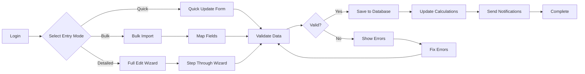
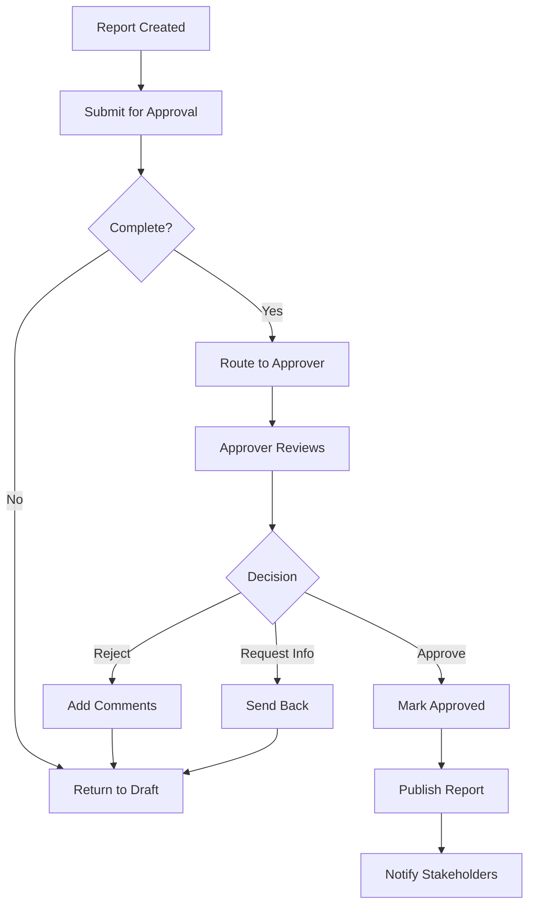

# Performance Management Module - TO-BE Redesign & Analysis

## Step 1: AS-IS Analysis Summary

### 1.1 Main Modules & Sub-Modules

**Current Structure:**
1. **Vision Level (مستوى الرؤية)**
   - Macroeconomic Indicators Management (UC-01)
   - Strategic Objectives L1 & L2 (UC-02)

2. **Program Level (مستوى البرنامج)**
   - Program List View (UC-03)
   - Quarterly Report Generation (UC-04)
   - Program Wizard (8 steps):
     - Program Overview (UC-05)
     - Program KPIs (UC-06)
     - Initiative Summary (UC-07)
     - MEI Contribution (UC-08)
     - Budgets (UC-09)
     - Key Achievements (UC-10)
     - Key Risks (UC-11, UC-12)
     - Required Support (UC-13)

3. **Initiative Level (مستوى المبادرات)**
   - Initiative List & Quick Access (UC-14)
   - Initiative Details (UC-15)
   - Initiative KPIs (UC-16)
   - Initiative Budget (UC-17)
   - Initiative Milestones (UC-18)

4. **Approvals (موافقاتي)**
   - Approval List Management (UC-19)
   - Report Review (UC-20)

5. **My Requests (طلباتي)**
   - User Submitted Requests (UC-21)

6. **Indicator Thresholds (حالات قياس المؤشرات)**
   - Threshold Management (UC-22)
   - Add New Threshold (UC-23)
   - Edit Existing Threshold (UC-24)

### 1.2 Entities & Key Fields

1. **MacroeconomicIndicator (MEI)**
   - Code (MEI.001-008)
   - Name (AR/EN)
   - Unit, Baseline Value/Date
   - Target 2030
   - Calculation Formula
   - Polarity (Increasing/Decreasing)
   - Measurement Frequency

2. **StrategicObjective**
   - Level (1-5)
   - Code (KPI01, etc.)
   - Name (AR/EN)
   - Linked Programs
   - Performance Metrics

3. **Program (VRP)**
   - 13 Vision Realization Programs
   - Status (Active/Suspended/Complete)
   - Quarterly Performance Data
   - Executive Summary (AR/EN)
   - Budget, Achievements, Risks

4. **Initiative**
   - 500+ initiatives
   - Milestones
   - Budget tracking
   - KPI linkage

5. **KPI**
   - Target vs Actual values
   - Achievement Rate
   - Performance Drivers/Barriers
   - Brief Explanations

6. **Risk**
   - Probability × Impact matrix
   - Mitigation Plans
   - Top 5 critical risks

7. **Achievement**
   - Impact Level (High/Medium/Low)
   - Category (Strategic/Operational/Quick Win)

8. **Budget**
   - Approved/Actual/Committed
   - Utilization Rate

9. **SupportRequest**
   - Type (Financial/Technical/Administrative/Legal)
   - Priority (Critical/High/Medium/Low)

10. **PerformanceThreshold**
    - Red/Yellow/Green ranges
    - Custom configurations

### 1.3 User Roles & Permissions

1. **Performance Manager (مدير الأداء)**
   - Full CRUD on assigned programs/initiatives
   - Create/export reports
   - Update KPIs and MEI

2. **Program Owner (مالك البرنامج)**
   - Edit assigned program (partial)
   - Submit reports for approval
   - Add achievements, risks, support requests

3. **Initiative Owner (مالك المبادرة)**
   - Edit assigned initiative (partial)
   - Update KPIs, milestones, budget

4. **Approver (موافق)**
   - Review and approve/reject reports
   - Add comments and decisions

5. **Executive (تنفيذي)**
   - Read-only access to dashboards
   - Export non-sensitive reports

6. **System Administrator (مسؤول النظام)**
   - Full system access
   - Configure thresholds
   - User management

7. **Data Entry Clerk (موظف إدخال البيانات)**
   - Basic data entry
   - View own entered data

### 1.4 Business Rules (Key Rules)

- **BR-01 to BR-20**: MEI-specific rules (codes, calculations, validations)
- **BR-21 to BR-41**: Strategic Objective rules
- **BR-42 to BR-60**: Program-level rules
- **BR-61 to BR-80**: Initiative rules
- **BR-81 to BR-100**: Workflow and approval rules
- **BR-101 to BR-120**: Integration and sync rules

Key calculation: Performance Score = ((Actual - Baseline) / (Target - Baseline)) × 100

### 1.5 Current Pain Points & Issues

1. **Complex 8-step wizard** for program data entry
2. **Redundant data entry** across levels
3. **No unified dashboard** for cross-level view
4. **Manual calculations** in some areas
5. **Limited real-time collaboration**
6. **Separate approval tracking** from main workflow
7. **No predictive analytics** or AI assistance
8. **Complex navigation** between levels

## Step 2: TO-BE Module Concept

### 2.1 Information Architecture

**New Structure:**
```
Performance Hub
├── Executive Dashboard (NEW)
│   ├── Vision 2030 Overview
│   ├── Real-time KPI Monitor
│   └── Alerts & Notifications
├── Performance Planning
│   ├── Goal Setting
│   ├── KPI Definition
│   └── Threshold Configuration
├── Performance Tracking
│   ├── Data Entry Hub (UNIFIED)
│   ├── Quick Update Forms
│   └── Bulk Import/Export
├── Performance Analysis
│   ├── Vision Analytics
│   ├── Program Analytics
│   ├── Initiative Analytics
│   └── Comparative Analysis
├── Reporting Center
│   ├── Report Builder
│   ├── Template Library
│   └── Scheduled Reports
├── Workflow Management
│   ├── My Tasks
│   ├── Approvals
│   └── Requests
└── Administration
    ├── User Management
    ├── System Settings
    └── Audit Logs
```

### 2.2 Main User Journeys

#### Journey 1: Executive Monthly Review
**Goal**: Quick performance overview and decision making
**Steps**:
1. Login → Executive Dashboard
2. Review high-level metrics
3. Drill down to problem areas
4. View recommendations
5. Approve/Request actions

#### Journey 2: Program Owner Quarterly Reporting
**Goal**: Complete quarterly report efficiently
**Steps**:
1. Login → My Tasks
2. Open Quarterly Report Checklist
3. Update data via Quick Forms
4. Review auto-generated report
5. Submit for approval

#### Journey 3: Performance Manager Analysis
**Goal**: Analyze trends and provide insights
**Steps**:
1. Login → Performance Analysis
2. Select analysis type
3. Configure parameters
4. Generate insights
5. Create action items
6. Share with stakeholders

#### Journey 4: Data Entry Specialist Update
**Goal**: Efficiently update multiple KPIs
**Steps**:
1. Login → Data Entry Hub
2. Select batch update mode
3. Enter/Import data
4. Validate entries
5. Submit batch

#### Journey 5: Approver Review Cycle
**Goal**: Review and approve submitted reports
**Steps**:
1. Login → Approvals Queue
2. Open report for review
3. Use inline commenting
4. Approve/Reject with notes
5. Track decision history

### 2.3 Improvements & Innovations

**Merged/Consolidated**:
- Unified data entry across all levels
- Single dashboard for all metrics
- Combined approval and request tracking

**Added Features**:
- AI-powered insights and predictions
- Real-time collaboration tools
- Mobile-responsive design
- Automated report generation
- Smart notifications
- Data validation wizard
- Performance forecasting
- Benchmark comparisons

**Removed Redundancies**:
- Eliminated duplicate data entry
- Consolidated similar forms
- Unified calculation engines

## Step 3: Screen Inventory

| Screen_ID | Screen Name | Type | Main Role(s) | Purpose | Key Components | Related BRs |
|-----------|-------------|------|--------------|---------|----------------|-------------|
| SCR-01 | Login | Form | All | User authentication | Username, Password, 2FA | BR-Security |
| SCR-02 | Executive Dashboard | Dashboard | Executive, Manager | High-level performance overview | KPI cards, charts, alerts | BR-01, BR-27 |
| SCR-03 | Vision Performance Dashboard | Dashboard | All | Vision 2030 metrics | MEI indicators, progress bars | BR-01 to BR-20 |
| SCR-04 | Program Performance Dashboard | Dashboard | Program Owner | Program-specific metrics | KPIs, budget, risks | BR-42 to BR-60 |
| SCR-05 | Initiative Performance Dashboard | Dashboard | Initiative Owner | Initiative metrics | Milestones, KPIs | BR-61 to BR-80 |
| SCR-06 | MEI List View | Listing | Manager, Executive | Browse all MEI | Table, filters, search | BR-01 |
| SCR-07 | MEI Detail Edit | Form | Manager | Edit MEI values | Value entry, calculations | BR-02 to BR-10 |
| SCR-08 | Strategic Objectives List | Listing | All | Browse objectives | Hierarchical list | BR-21 |
| SCR-09 | Strategic Objective Detail | Form | Manager | Edit objective | KPIs, targets | BR-22 to BR-30 |
| SCR-10 | Program List | Listing | All | Browse programs | Cards, filters | BR-42 |
| SCR-11 | Program Quick Update | Form | Program Owner | Quick data entry | Essential fields only | BR-43 |
| SCR-12 | Program Full Edit | Wizard | Program Owner | Complete program update | 8 sections | BR-44 to BR-50 |
| SCR-13 | Initiative List | Listing | All | Browse initiatives | Table, filters | BR-61 |
| SCR-14 | Initiative Quick Update | Form | Initiative Owner | Quick updates | Key fields | BR-62 |
| SCR-15 | Initiative Full Edit | Wizard | Initiative Owner | Complete update | 4 tabs | BR-63 to BR-70 |
| SCR-16 | KPI Definition | Form | Manager | Define new KPI | Formula, thresholds | BR-27 |
| SCR-17 | KPI Bulk Update | Form | Data Entry | Mass update KPIs | Grid editor | BR-28 |
| SCR-18 | Budget Overview | Dashboard | All | Budget status | Charts, tables | BR-Budget |
| SCR-19 | Budget Detail | Form | Program Owner | Budget management | Allocation, spending | BR-Budget |
| SCR-20 | Risk Matrix | Dashboard | Manager | Risk overview | Heat map | BR-Risk |
| SCR-21 | Risk Detail | Form | Program Owner | Risk management | Assessment, mitigation | BR-Risk |
| SCR-22 | Achievement Gallery | Listing | All | Browse achievements | Cards, categories | BR-Achievement |
| SCR-23 | Achievement Entry | Form | Program Owner | Add achievement | Details, impact | BR-Achievement |
| SCR-24 | Support Request List | Listing | All | Browse requests | Table, status | BR-Support |
| SCR-25 | Support Request Form | Form | Program Owner | Submit request | Type, priority | BR-Support |
| SCR-26 | My Tasks | Listing | All | Personal tasks | Todo list | BR-Workflow |
| SCR-27 | Approval Queue | Listing | Approver | Pending approvals | Queue, filters | BR-81 |
| SCR-28 | Approval Detail | Form | Approver | Review submission | Report, comments | BR-82 |
| SCR-29 | Report Builder | Wizard | Manager | Create custom report | Template, data | BR-Report |
| SCR-30 | Report Template Library | Listing | Manager | Browse templates | Cards | BR-Report |
| SCR-31 | Generated Reports | Listing | All | View reports | Table, download | BR-Report |
| SCR-32 | Data Import | Wizard | Data Entry | Bulk import | Upload, mapping | BR-Import |
| SCR-33 | Data Export | Form | All | Export data | Format, filters | BR-Export |
| SCR-34 | Performance Analysis | Dashboard | Manager | Analytics | Charts, insights | BR-Analysis |
| SCR-35 | Trend Analysis | Dashboard | Manager | Trend tracking | Time series | BR-Analysis |
| SCR-36 | Comparative Analysis | Dashboard | Manager | Comparisons | Benchmarks | BR-Analysis |
| SCR-37 | Forecast Model | Dashboard | Manager | Predictions | ML models | BR-Forecast |
| SCR-38 | Notification Center | Listing | All | Notifications | Alerts, messages | BR-Notification |
| SCR-39 | User Profile | Form | All | User settings | Preferences | BR-User |
| SCR-40 | User Management | Admin | Admin | Manage users | CRUD users | BR-Admin |
| SCR-41 | Role Management | Admin | Admin | Manage roles | Permissions | BR-Admin |
| SCR-42 | System Settings | Admin | Admin | System config | Parameters | BR-Admin |
| SCR-43 | Threshold Configuration | Admin | Admin | Configure thresholds | Ranges | BR-22, BR-23 |
| SCR-44 | Audit Log | Listing | Admin | System audit | Log entries | BR-Audit |
| SCR-45 | Help Center | Content | All | User help | Documentation | BR-Help |
| SCR-46 | Search Results | Listing | All | Search results | Mixed results | BR-Search |
| SCR-47 | Calendar View | Calendar | All | Timeline view | Events, deadlines | BR-Calendar |
| SCR-48 | Mobile Dashboard | Dashboard | All | Mobile view | Responsive cards | BR-Mobile |
| SCR-49 | Collaboration Space | Form | All | Team collaboration | Comments, chat | BR-Collab |
| SCR-50 | API Documentation | Content | Developer | API docs | Endpoints | BR-API |

## Step 4: Flows & Navigation

### 4.1 Sitemap

```mermaid
graph TB
    A[Performance Hub] --> B[Executive Dashboard]
    A --> C[Performance Planning]
    A --> D[Performance Tracking]
    A --> E[Performance Analysis]
    A --> F[Reporting Center]
    A --> G[Workflow Management]
    A --> H[Administration]
    
    B --> B1[Vision 2030 Overview]
    B --> B2[Real-time KPI Monitor]
    B --> B3[Alerts & Notifications]
    
    C --> C1[Goal Setting]
    C --> C2[KPI Definition]
    C --> C3[Threshold Configuration]
    
    D --> D1[Data Entry Hub]
    D --> D2[Quick Update Forms]
    D --> D3[Bulk Import/Export]
    
    E --> E1[Vision Analytics]
    E --> E2[Program Analytics]
    E --> E3[Initiative Analytics]
    E --> E4[Comparative Analysis]
    
    F --> F1[Report Builder]
    F --> F2[Template Library]
    F --> F3[Scheduled Reports]
    
    G --> G1[My Tasks]
    G --> G2[Approvals]
    G --> G3[Requests]
    
    H --> H1[User Management]
    H --> H2[System Settings]
    H --> H3[Audit Logs]
```



### 4.2 Data Entry Flow



### 4.3 Approval Flow



## Step 5: HTML Prototype Structure

The interactive prototype will consist of:
- 50+ HTML pages representing each screen
- Responsive CSS framework
- JavaScript for interactivity
- Mock data for realistic presentation
- Clear navigation between screens
- Business rule comments in code

## Step 6: TO-BE BRD Skeleton

### 1. Introduction & Scope
   - 1.1 Document Purpose
   - 1.2 System Overview
   - 1.3 Document Conventions

### 2. Stakeholders & Roles
   - 2.1 Stakeholder Matrix
   - 2.2 Role Definitions
   - 2.3 Permission Matrix

### 3. TO-BE Overview & Principles
   - 3.1 Design Principles
   - 3.2 User Experience Goals
   - 3.3 Technical Architecture

### 4. Modules & Sub-modules
   - 4.1 Performance Hub
   - 4.2 Executive Dashboard
   - 4.3 Performance Planning
   - 4.4 Performance Tracking
   - 4.5 Performance Analysis
   - 4.6 Reporting Center
   - 4.7 Workflow Management
   - 4.8 Administration

### 5. Detailed Screen Specifications
   - 5.1 SCR-01: Login
   - 5.2 SCR-02: Executive Dashboard
   - [... all 50 screens ...]
   - 5.50 SCR-50: API Documentation

### 6. Business Rules
   - 6.1 Calculation Rules
   - 6.2 Validation Rules
   - 6.3 Workflow Rules
   - 6.4 Integration Rules

### 7. Data Model
   - 7.1 Entity Relationship Diagram
   - 7.2 Entity Specifications
   - 7.3 Data Dictionary

### 8. Integrations
   - 8.1 Internal Systems
   - 8.2 External APIs
   - 8.3 Data Synchronization

### 9. Non-functional Requirements
   - 9.1 Performance
   - 9.2 Security
   - 9.3 Usability
   - 9.4 Localization

### 10. Assumptions & Open Issues
   - 10.1 Assumptions
   - 10.2 Dependencies
   - 10.3 Open Issues
   - 10.4 Risk Register
