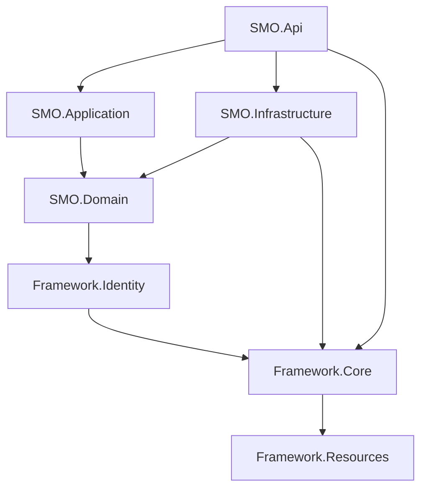

# 2. Solution Structure

## 2.1 Project Organization

### Root Directory Structure (ACTUAL)

```
SMO (PM Prototype)/
├── SMO.sln                          # Visual Studio solution file
├── src/                             # Backend source code (all .NET projects)
│   ├── Framework/                   # Framework layer projects (271 files)
│   │   ├── Framework.Core/          # Core framework & cross-cutting concerns
│   │   ├── Framework.Identity/      # Authentication & authorization (74 files)
│   │   └── Framework.Resources/     # Localization resources (6 files)
│   ├── SMO.Domain/                  # Domain entities & interfaces (24 files)
│   ├── SMO.Application/             # Business logic & services (16 files)
│   ├── SMO.Infrastructure/          # Data access & external services (6 files)
│   ├── SMO.Api/                     # Web API entry point (12 files)
│   └── SMO.Frontend/                # Frontend projects (21 files)
│       └── SMO-Portal/              # Angular 18 application (TypeScript/Angular)
├── SMO-Platform-UI/                 # UI Prototype & Working Frontend (Enhanced)
│   ├── *.html (30+ pages)          # Complete UI implementation pages
│   ├── css/ (9 files)               # Compiled stylesheets
│   ├── js/ (18 files)               # JavaScript modules & API integration
│   ├── sass/ (31 files)             # SASS source files (components/pages)
│   ├── assets/                      # Static assets & components
│   │   ├── components/              # Reusable HTML components
│   │   ├── css/                     # Additional component styles
│   │   └── js/                      # Component scripts
│   ├── images/ (49 files)           # UI assets, icons, backgrounds
│   ├── fonts/ (30 files)            # 29LTBukra Arabic font family
│   ├── performance-hub/             # Performance module specific assets
│   ├── backup/                      # Backup files directory
│   └── Various utility files:       # Python scripts, batch files, configs
│       ├── *.py (Python utilities)
│       ├── *.bat (Windows batch scripts)
│       ├── *.ps1 (PowerShell scripts)
│       └── *.md (Documentation)
├── docs/                            # Project documentation
│   ├── architecture/                # Sharded architecture docs (16 files)
│   │   ├── index.md                # Architecture index
│   │   ├── 1-executive-summary.md through appendix-c
│   │   └── Various architecture sections
│   ├── BA/                          # Business analysis documents
│   │   └── performance-department/  # Performance dept specific (149 files)
│   │       ├── current/             # Current state documentation
│   │       ├── Field_Dictionaries_READY/ # Field mappings
│   │       ├── Performance_Module_Prototype/
│   │       └── wireframes - Consildated report/
│   ├── stories/                     # User stories & epics
│   │   ├── 0.0.project-foundation-setup.story.md
│   │   └── 1.1.story.md
│   ├── PRD.md                       # Product Requirements Document
│   ├── ARCHITECTURE.md              # Legacy architecture document
│   └── Various module docs:         # Module-specific documentation
│       ├── PERFORMANCE_MODULE_*.md
│       └── Other module documentation
├── assets/                          # Root-level temporary assets (5 images)
├── .bmad-core/                      # BMAD Method configuration (implied)
├── README.md                        # Project readme
├── AGENTS.md                        # BMAD agents configuration
└── CLAUDE.md                        # Claude AI documentation
```

### Backend Projects Structure (src/) - ACTUAL

```
src/
├── Framework/
│   ├── Framework.Core/              # Core framework implementation
│   │   ├── Data/                    # Data access foundation
│   │   │   ├── BaseDbContext.cs    # Base context implementation
│   │   │   ├── EntityBase.cs       # Base entity classes
│   │   │   ├── Mapping/             # Entity mapping configurations
│   │   │   ├── Paging/ (5 files)   # Pagination support
│   │   │   ├── Repositories/        # Repository pattern implementation
│   │   │   └── Uow/                 # Unit of Work pattern
│   │   ├── Angular/                 # Angular integration DTOs
│   │   ├── AutoMapper/              # AutoMapper configuration
│   │   ├── BackgroundJobs/         # Hangfire job processing
│   │   ├── Caching/                 # Memory & per-request caching
│   │   ├── DataAnnotations/ (20 files) # Custom validation attributes
│   │   ├── DependencyManagement/    # Auto-registration helpers
│   │   ├── Drawing/                 # PDF & QR code generation
│   │   ├── Extensions/ (24 files)   # Extension methods library
│   │   ├── Globalization/           # Culture & localization
│   │   ├── Helpers/                 # File & attachment helpers
│   │   ├── Middlewares/             # Exception & API middleware
│   │   ├── Migrations/ (13 files)   # EF Core database migrations
│   │   ├── Notifications/ (15 files) # Notification system
│   │   ├── SharedServices/ (32 files) # Shared business services
│   │   ├── Utils/ (7 files)         # Utility classes
│   │   ├── Validators/ (8 files)    # FluentValidation rules
│   │   └── Core files:              # Core framework files
│   │       ├── ApiResponse.cs
│   │       ├── ApplicationLogging.cs
│   │       ├── Check.cs
│   │       ├── CommonHelper.cs
│   │       └── Various DTOs
│   ├── Framework.Identity/
│   │   ├── Data/                    # Identity entities & DbContext
│   │   └── Migrations/              # Identity migrations
│   └── Framework.Resources/
│       └── SharedResources.*.resx    # Localization resource files
│
├── SMO.Domain/
│   ├── Entities/
│   │   ├── Core/                    # Core domain entities
│   │   ├── Performance/             # Performance module entities
│   │   ├── Financial/               # Financial entities
│   │   └── Risk/                    # Risk management entities
│   ├── Enums/                       # Domain enumerations
│   └── Interfaces/                  # Repository & DbContext interfaces
│
├── SMO.Application/
│   ├── Features/                    # Feature-based organization
│   │   ├── Attachment/
│   │   ├── Initiative/
│   │   ├── InitiativeMilestone/
│   │   ├── KPI/
│   │   ├── Lookup/
│   │   ├── Performance/             # Performance feature implementation
│   │   │   ├── DTOs/               # Data transfer objects
│   │   │   │   ├── DashboardDtos.cs
│   │   │   │   ├── MacroeconomicIndicatorDto.cs
│   │   │   │   └── ProgramPerformanceDto.cs
│   │   │   └── Services/           # Performance services
│   │   │       ├── PerformanceAggregatorService.cs
│   │   │       └── PerformanceManagementService.cs
│   │   ├── Pillar/
│   │   ├── StrategicObjective/
│   │   ├── Theme/
│   │   ├── VisionProgram/
│   │   └── Workflow/
│   ├── MappingProfiles/            # AutoMapper profiles
│   ├── Services/                    # General application services
│   ├── Shared/                      # Shared DTOs and interfaces
│   │   ├── DTOs/
│   │   │   ├── KPIDto.cs
│   │   │   └── ProgramDto.cs
│   │   └── Interfaces/
│   │       ├── IBudgetService.cs
│   │       ├── IInitiativeService.cs
│   │       ├── IKPIService.cs
│   │       ├── IMilestoneService.cs
│   │       ├── IProgramService.cs
│   │       └── IRiskService.cs
│   ├── Class1.cs                    # Placeholder/temporary class
│   └── ServiceCollectionExtensions.cs # DI configuration
│
├── SMO.Infrastructure/
│   ├── Data/                        # DbContext, Repository, UnitOfWork
│   ├── Repositories/                # Feature-specific repositories
│   │   ├── Initiative/
│   │   ├── KPI/
│   │   ├── Program/
│   │   ├── StrategicObjective/
│   │   └── Vision/
│   ├── Mapping/                     # Entity-to-DTO mapping
│   │   ├── Attachment/
│   │   ├── Initiative/
│   │   ├── KPI/
│   │   ├── Lookup/
│   │   ├── Program/
│   │   ├── StrategicObjective/
│   │   └── Vision/
│   └── ApiClients/                  # External API clients
│
├── SMO.Api/
│   ├── Controllers/                 # API controllers
│   │   ├── Performance/            # Performance module controllers
│   │   ├── HealthController.cs
│   │   └── PerformanceController.cs
│   ├── Filters/                     # Action filters
│   ├── Program.cs                   # Application entry point
│   ├── appsettings.json             # Configuration
│   └── nlog.config                  # Logging configuration
│
└── SMO.Frontend/
    └── SMO-Portal/                  # Angular 18 project
        ├── src/                      # Angular source code
        ├── angular.json              # Angular configuration
        ├── package.json              # NPM dependencies
        └── tsconfig.json             # TypeScript configuration
```

### UI Implementation (SMO-Platform-UI/) - ACTIVE FRONTEND

**Note:** This is NOT just a prototype but an active, enhanced UI implementation with full functionality including API integration, CRUD operations, and complete page implementations.

```
SMO-Platform-UI/
├── Core Pages (30+ HTML files)      # Fully functional UI pages
│   ├── index.html                   # Main dashboard
│   ├── login.html                   # Authentication page
│   ├── performance-*.html          # Performance module suite (7 pages)
│   │   ├── performance-dashboard.html
│   │   ├── performance-vision.html
│   │   ├── performance-programs.html
│   │   ├── performance-initiatives.html
│   │   ├── performance-approvals.html
│   │   ├── performance-requests.html
│   │   └── performance-thresholds.html
│   ├── executive-performance-dashboard.html # Executive view
│   ├── indicators.html              # KPI indicators management
│   ├── milestone-tracking.html      # Milestone management
│   ├── risk-escalation.html        # Risk management
│   ├── report-generation.html      # Reporting module
│   ├── audit-logs.html             # System audit trails
│   ├── data-sync-status.html       # Data synchronization
│   ├── achievements.html           # Achievements tracking
│   ├── initiative-details.html     # Initiative management
│   ├── program-wizard.html         # Program creation wizard
│   ├── profile.html                # User profile
│   ├── settings.html               # System settings
│   └── vision.html                 # Vision management
│
├── Stylesheets                      # Complete styling system
│   ├── css/ (9 compiled files)     # Production CSS
│   │   ├── bootstrap.min.css       # Bootstrap framework
│   │   ├── styles.css              # Main application styles
│   │   └── Various libraries       # Third-party CSS
│   └── sass/ (31 source files)     # SASS source organization
│       ├── abstracts/               # Variables, mixins
│       ├── base/                    # Fonts, resets
│       ├── components/ (21 files)   # Component styles
│       └── pages/ (4 files)        # Page-specific styles
│
├── JavaScript Modules (18 files)    # Full application logic
│   ├── api-service.js              # API integration layer
│   ├── crud-operations.js          # CRUD operations handler
│   ├── loading-states.js           # Loading state management
│   ├── search.js                   # Search functionality
│   ├── scripts.js                  # Main application script
│   ├── fix-icons.js                # Icon management
│   ├── timepicker.js              # Date/time picker
│   └── Various libraries           # jQuery, Bootstrap, etc.
│
├── Assets & Resources
│   ├── images/ (49 files)          # Complete icon & image set
│   │   ├── nav-icons/ (12 SVGs)    # Navigation icons
│   │   ├── favicons/               # Browser favicons
│   │   └── Various UI assets       # Logos, backgrounds, etc.
│   ├── fonts/ (30 files)           # 29LTBukra Arabic font family
│   │   └── Complete web font set   # EOT, SVG, TTF, WOFF, WOFF2
│   └── assets/                      # Additional components
│       ├── components/              # Reusable HTML components
│       │   └── sidebar.html        # Unified sidebar component
│       ├── css/ (4 files)          # Component-specific styles
│       └── js/ (3 files)           # Component scripts
│
├── Development Tools & Scripts
│   ├── Python Utilities (*.py)      # Development helper scripts
│   │   ├── comprehensive-fixes.py  # Code fixes automation
│   │   └── add_dev_indicators.py   # Development indicators
│   ├── Batch Scripts (*.bat)       # Windows automation
│   │   ├── START-SERVER.bat        # Server launcher
│   │   └── apply-unified-sidebar.bat # Sidebar deployment
│   └── PowerShell (*.ps1)          # PowerShell scripts
│
├── Documentation & Reports
│   ├── README.md                   # UI documentation
│   ├── UNIFIED-SIDEBAR-README.md   # Sidebar documentation
│   ├── TEST_REPORT.md              # Test results
│   └── FIX_SUMMARY_REPORT.md       # Fix implementations
│
└── Configuration Files
    └── UNIFIED-SIDEBAR-LOCK.json   # Sidebar configuration lock
```

### Solution File Organization

The `SMO.sln` file organizes projects into logical groups:

- **Solution Root Projects:**
  - `SMO.Domain`
  - `SMO.Application`
  - `SMO.Infrastructure`
  - `SMO.Api`

- **Framework Solution Folder:**
  - `Framework.Core`
  - `Framework.Identity`
  - `Framework.Resources`

**Note:** The Angular frontend (`SMO.Frontend/SMO-Portal`) is managed separately via `package.json` and `angular.json` and is not included in the .sln file.

### Key Directory Notes (Reality Check)

1. **Backend projects under `src/`**: Contains 339+ .NET files organized in clean architecture pattern with Framework, Domain, Application, Infrastructure, and API layers.

2. **Feature-based organization in Application layer**: The `SMO.Application/Features/` folder organizes code by business features with detailed implementation for Performance module including DTOs and Services.

3. **SMO-Platform-UI is ACTIVE FRONTEND**: This is NOT just a prototype but a fully functional UI with:
   - 30+ complete HTML pages with full functionality
   - API integration via `api-service.js`
   - CRUD operations support
   - Complete styling system (SASS/CSS)
   - Arabic font support (29LTBukra family)
   - Development tools and utilities
   - Active development with fix scripts and reports

4. **Documentation is comprehensive**: The `docs/` folder contains:
   - Sharded architecture documentation (16 files)
   - Extensive BA documentation (149 files in performance-department)
   - User stories and PRD
   - Performance module specific documentation
   - Wireframes and prototypes

5. **BMAD Method Integration**: Project uses BMAD methodology with `AGENTS.md` and likely `.bmad-core/` configuration for structured development.

6. **Mixed Development Approach**: 
   - Backend: .NET 8 with Clean Architecture
   - Frontend: Both static HTML/JS (active) and Angular 18 (in development)
   - Documentation: Markdown-based with BMAD structure

## 2.2 Project Dependencies



**Dependency Rules:**
- **Domain** has no dependencies except Framework.Identity (for user entities)
- **Application** depends only on Domain
- **Infrastructure** implements Domain interfaces and depends on Framework.Core
- **API** orchestrates all layers but contains minimal logic
- **Framework.Core** is self-contained except for Framework.Resources

## 2.3 Solution Configuration

The solution targets **.NET 8.0** with the following common settings:
- Nullable reference types enabled
- Implicit usings enabled
- Two configurations: Debug and Release

## 2.4 Implementation Status (Reality Check)

### Currently Active & Functional

1. **SMO-Platform-UI**: Fully functional HTML/JS frontend
   - Complete Performance Management module
   - 30+ implemented pages with full CRUD operations
   - API integration layer operational
   - Arabic localization with 29LTBukra fonts
   - Responsive design with Bootstrap
   - Active development with fix scripts

2. **Backend API (.NET 8)**: Partially implemented
   - Framework layer: Fully structured with 271 files
   - Domain entities: Basic structure in place
   - Application services: Performance module services active
   - Infrastructure: Data access patterns established
   - API controllers: Basic endpoints configured

3. **Documentation**: Comprehensive and growing
   - 149 files in BA/performance-department
   - Sharded architecture documentation (16 files)
   - User stories and PRD maintained
   - Field dictionaries and mappings complete

### In Development

1. **Angular 18 Frontend** (SMO.Frontend/SMO-Portal):
   - Project scaffolded but not primary UI
   - TypeScript configuration in place
   - Will eventually replace HTML/JS frontend

2. **Additional Modules**:
   - Risk Management
   - Financial Module
   - Workflow Engine

### Technical Debt & Notes

1. **Dual Frontend Strategy**: Currently maintaining both HTML/JS (active) and Angular (future)
2. **Class1.cs**: Placeholder file in SMO.Application needs cleanup
3. **Migration Path**: Need to plan transition from HTML/JS to Angular
4. **Performance Module**: Most mature with complete vertical slice implementation

---
