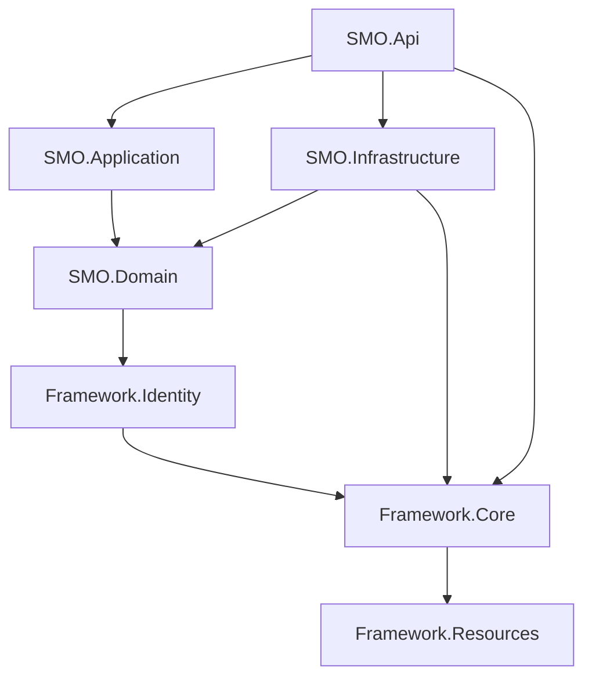

# 2. Solution Structure

## 2.1 Project Organization

```
SMO/
├── Framework/
│   ├── Framework.Core/              # Core framework & cross-cutting concerns
│   ├── Framework.Identity/          # Authentication & authorization
│   └── Framework.Resources/         # Localization resources
├── SMO.Domain/                      # Domain entities & interfaces
├── SMO.Application/                 # Business logic & services
├── SMO.Infrastructure/              # Data access & external services
├── SMO.Api/                         # Web API entry point
└── SMO.Frontend/
    └── SMO-Portal/                  # Angular application
```

## 2.2 Project Dependencies



**Dependency Rules:**
- **Domain** has no dependencies except Framework.Identity (for user entities)
- **Application** depends only on Domain
- **Infrastructure** implements Domain interfaces and depends on Framework.Core
- **API** orchestrates all layers but contains minimal logic
- **Framework.Core** is self-contained except for Framework.Resources

## 2.3 Solution Configuration

The solution targets **.NET 8.0** with the following common settings:
- Nullable reference types enabled
- Implicit usings enabled
- Two configurations: Debug and Release

---
